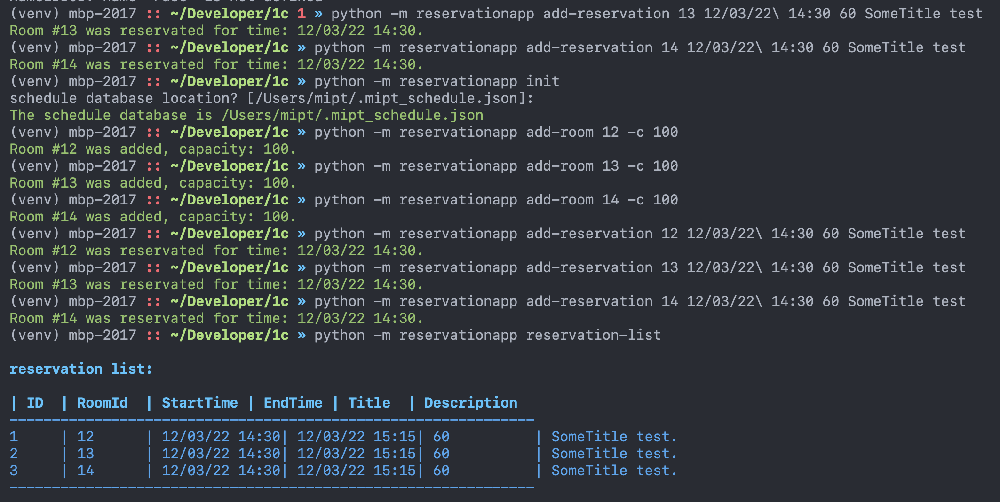

### Настройка проекта

1. Создайте виртуальное окружение:

   ```
   cd 1c/
   python -m venv ./venv
   source venv/bin/activate
   ```
2. Установите зависимости `python -m pip install -r requirements.txt `
3. Инициализируйте базу данных ``` python -m reservationapp init```

### Использование 

###### Полный список доступных команд можно посмотреть используя следующию команду

````
(venv) python -m reservationapp --help                
Usage: reservationapp [OPTIONS] COMMAND [ARGS]...

Options:
  -v, --version         Show the application's version and exit.
  --install-completion  Install completion for the current shell.
  --show-completion     Show completion for the current shell, to copy it or
                        customize the installation.

  --help                Show this message and exit.

Commands:
  add-reservation   Add a new reservation.
  add-room          Add a new room.
  init              Initialize the schedule database.
  reservation-list  List all reservation.
````

#### Пример




На данный момент доступен только базовый функционал -- добавление комнат в базу данных, бронирование комнат.

#### Как можно улучшить приложение

*Полезные функции*

Пользователь может:

* забронировать комнату:

1. Выбрав количество людей и желаемое время (будут предложены доступные комнаты для бронирования)
2. Выбрав определенную комнату (будет предложен список из доступных интервалов для бронирования)
3. Помимо этого можно указать необходимое техническое оснащение аудитории (допустим, планируется видеоконференция или использование проектора)

* посмотреть, занята ли комната в определенный интервал
* отменить бронь
* узнать, кто забронировал комнату в определенное время
* При бронировании пользователь должен указать список людей, приглашенных на событие. Этим людям на почту (например) будет выслано уведомление. При отмене бронирования приглашенные так же об этом будут уведомлены.
* Возможность добавить описание мероприятия
* Функция автоматического добавления в расписание (например, в гугл-календарь)
* Заблаговременное напоминание пользователю о событии Бронировать помещения и посещать события могут зарегестрированные (например, одобренные администратором/имеющие пропуск и т.д.) пользователи. Это, например, поможет отслеживать статистику использования помещений сотрудниками, в случае непредвиденных ситуаций найти человека и т.д. В этом случае удобно уметь делать запрос "зарегестрировать гостя" с последующим одобрением администратора.

*Возможные дополнительные варианты:*

* сделать функцию отслеживания явки на событие (т.е. если аудитория забронирована, но в течение 20 минут никто не пришел - автоматически отменить бронь)
* добавить функцию просмотра списка оборудования в комнате (есть ли проектор, переходники, доска и т.д)
